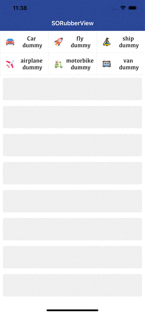
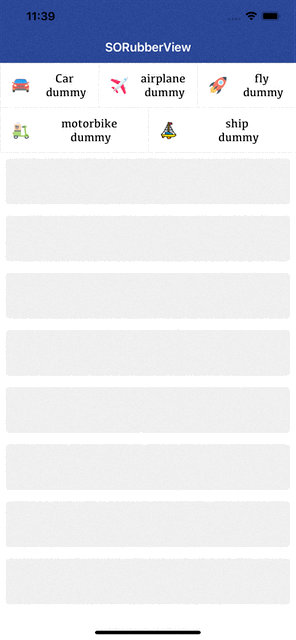
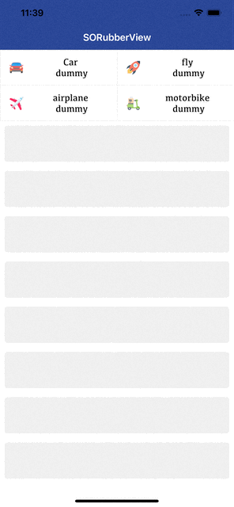

# SORubberView

## READ ME and HOW TO USE COMING SOON 

<table>
<thead>
<tr>
<th> </th>
<th></th>
<th></th>
</tr>
</thead>
</table>
   
## Example

To run the example project, clone the repo, and run `pod install` from the Example directory first.

## Requirements

## Installation

SORubberView is available through [CocoaPods](https://cocoapods.org). To install
it, simply add the following line to your Podfile:

```ruby
pod 'SORubberView'
```

## Author

Ahmadalsofi, alsofiahmad@yahoo.com

## License

SORubberView is available under the MIT license. See the LICENSE file for more info.
